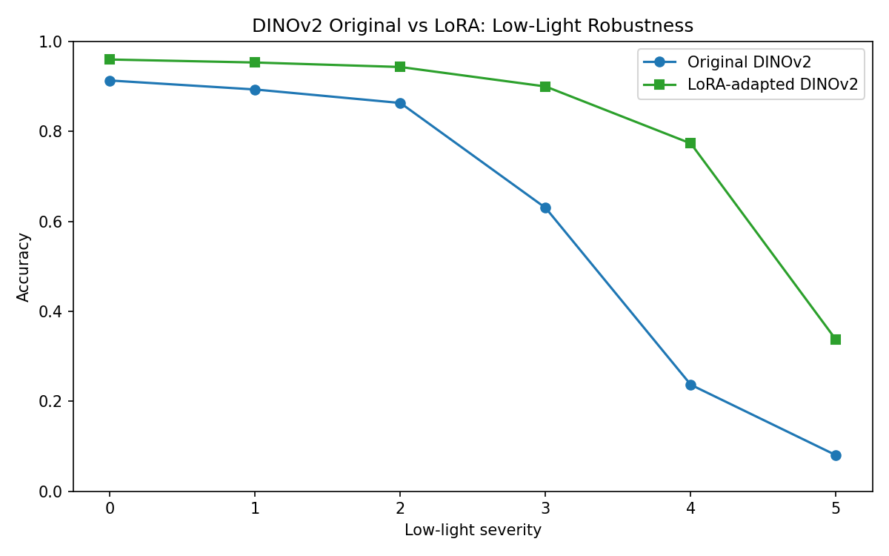
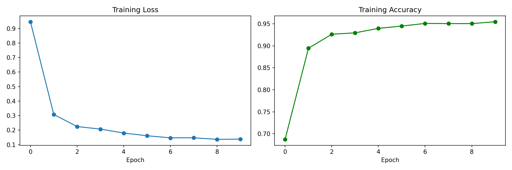

# DINOv2 Low-Light Robustness Study

**How badly does DINOv2 break in the dark, where does it break, why — and can we fix it by training 1% of the network?**

This project stress-tests Facebook's **DINOv2 ViT-S/14** (frozen, self-supervised backbone) against progressive low-light degradation on **CIFAR-10**, localizes the failure inside the network, identifies its mechanism, and remediates it with LoRA adapters.

---

## The Three-Phase Pipeline

```
Phase 1: MEASURE          Phase 2: LOCALIZE & EXPLAIN        Phase 3: REMEDIATE
run_notebook1.py          run_notebook2.py                   run_lora_simple_colab.py
1000 imgs, 6 severities   500 imgs + layer hooks + FFT       LoRA rank-8 on attention
linear probe accuracy     CKA drift, frequency ablation,     70% dark / 30% clean diet
+ embedding drift         bootstrap CIs                      10 epochs, T4 GPU
```

**Corruption model:** `low_light()` scales pixel intensity down and adds Gaussian noise — severity 0 = clean, severity 5 = near-black + heavy noise (ImageNet-C style).

---

## Results Summary: How the Three Phases Connect

Each phase answers one question and hands its finding to the next:

| Phase | Question | Answer | Hands to next phase |
|-------|----------|--------|---------------------|
| **1 — Measure** | *How bad is it?* | Accuracy collapses **0.91 → 0.09**; embeddings drift to near-orthogonality (cos 1.00 → 0.16) | The failure is real, severe, and representational — *but where?* |
| **2 — Localize & explain** | *Where and why?* | CKA pins the drift on **late attention blocks** (max drop 0.82 at block 10 vs 0.57 at patch embed); frequency ablation shows the model runs on **low-frequency luminance** — exactly what darkness removes | The failure has an address (late attention) and a mechanism (lost low-freq structure) — *so fix that, precisely* |
| **3 — Remediate** | *Can it be fixed cheaply?* | LoRA on those attention layers (0.99% of params, 70/30 dark/clean diet) restores **mean 0.60 → 0.81**, **worst-case 4.2×**, clean accuracy unchanged-or-better | Confirms the causal story: fix the localized shift, recover the robustness |

All phases on one axis — accuracy per severity (Phase 3 run; the original column matches Phase 1 within run-to-run noise from the different test-sample sizes):

| Severity | Original DINOv2 | Embedding drift (cos sim) | + LoRA | Gap recovered |
|----------|-----------------|---------------------------|--------|---------------|
| 0 (clean) | 0.913 | 1.000 | 0.960 | clean gets *better* |
| 1 | 0.893 | 0.946 | 0.953 | +0.060 |
| 2 | 0.863 | 0.810 | 0.943 | +0.080 |
| 3 | 0.630 | 0.589 | 0.900 | +0.270 |
| 4 | 0.237 | 0.309 | 0.773 | +0.537 |
| 5 (darkest) | 0.080 | 0.161 | 0.337 | +0.257 |

The drift column is the Phase 1/2 fingerprint: accuracy loss tracks embedding drift almost linearly. The LoRA column shows the recovery tracks the *same axis back up*. One phenomenon, measured, explained, and reversed.

---

## Results

### Phase 1 — DINOv2 is not robust to darkness

Linear probe (logistic regression on frozen embeddings), 1000 test images:

| Severity | Accuracy | Cosine sim to clean embeddings |
|----------|----------|-------------------------------|
| 0 (clean) | 0.913 | 1.000 |
| 1 | 0.900 | 0.946 |
| 2 | 0.860 | 0.810 |
| 3 | 0.603 | 0.589 |
| 4 | 0.220 | 0.309 |
| 5 (darkest) | 0.093 | 0.161 |

Accuracy falls **0.82 points** and embeddings drift to near-orthogonality (cos ~0.16). Collapse begins below severity 3.

### Phase 2 — The failure is localized, systematic, and low-frequency

**Layer-wise CKA** (hooks on all 12 transformer blocks, drift measured clean → severity 5):

| Layer | CKA drop |
|-------|----------|
| block 0 (patch embed) | 0.57 |
| block 5 | 0.45 |
| **block 10** | **0.82** ← max drift |
| block 11 (final) | 0.79 |

→ Degradation is **not uniform**: late attention layers shift their representations far more than early ones.

**Frequency ablation** (low-pass vs. high-pass filtered inputs): low-pass-filtered images retain near-clean accuracy (~0.92 at severity 1) while high-pass destroys it (~0.59) — at every severity the low-frequency band dominates.

→ DINOv2 leans on **low-frequency luminance structure**, which is precisely what darkness removes.

### Phase 3 — LoRA on late attention layers recovers most of the loss

LoRA adapters (rank 8, α 16) on QKV/output projections, **221K trainable params = 0.99%** of the network, trained 10 epochs on 5000 images (70% darkened / 30% clean). Free-tier Colab T4, ~10 minutes.

| Severity | Original | LoRA | Δ |
|----------|----------|------|-----|
| 0 (clean) | 0.913 | 0.960 | +0.047 |
| 1 | 0.893 | 0.953 | +0.060 |
| 2 | 0.863 | 0.943 | +0.080 |
| 3 | 0.630 | 0.900 | **+0.270** |
| 4 | 0.237 | 0.773 | **+0.537** |
| 5 (darkest) | 0.080 | 0.337 | **+0.257** |
| **Mean** | **0.603** | **0.811** | **+0.208** |

**Worst-case accuracy improved 4.2×**, the near-failure regime (severity 4) recovered to 0.77, and clean accuracy *rose* — no catastrophic forgetting from the mixed diet.





---

## The Story in One Paragraph

DINOv2's low-light failure is **not** diffuse noise sensitivity. It is a systematic representational shift concentrated in the **late attention layers** (CKA drop 0.82 at block 10 vs 0.57 at the patch embedding), driven by the loss of **low-frequency luminance structure** — the exact signal the model depends on most. Because the failure is localized, a **targeted 0.99%-parameter intervention** (LoRA on attention, trained on a dark/clean mix) recovers +0.21 mean accuracy and 4.2× worst-case robustness at a training cost of ~10 GPU-minutes. Robustness to darkness in self-supervised ViTs is cheap to buy back — if you know where to look.

---

## Running It

### Local (CPU, ~10–25 min per analysis notebook)

```bash
python3 -m venv .venv && source .venv/bin/activate
pip install torch torchvision scikit-learn matplotlib numpy scipy
python run_notebook1.py    # Phase 1 → output/notebook1/
python run_notebook2.py    # Phase 2 → output/notebook2/
```

### Colab GPU (LoRA, ~15 min on free-tier T4)

Paste or upload `run_lora_simple_colab.py` into a Colab notebook and run — it installs its own deps and writes to `/content/output/`. Via the Colab CLI:

```bash
colab new -s lora_run --gpu T4
colab upload -s lora_run run_lora_simple_colab.py /content/run_lora_simple_colab.py
colab exec -s lora_run -f launch_lora.py    # nohup-detached launcher
```

---

## Repository Layout

| Path | Role |
|------|------|
| `utils.py` | Shared library: corruption fns, DINOv2 loading, hook extraction, linear probe, CKA, bootstrap CI, plotting |
| `run_notebook1.py` / `run_notebook1_colab.py` | Phase 1 runner (local / Colab) |
| `run_notebook2.py` / `run_notebook2_colab.py` | Phase 2 runner: CKA, frequency ablation, bootstrap CIs (local / Colab) |
| `run_lora_simple_colab.py` | Phase 3: manual LoRA (no PEFT dependency) — used for the results above |
| `run_lora_finetune_colab.py` | Phase 3 alternative using the PEFT library |
| `dinov2_*.ipynb` | Original notebook forms of all three phases |
| `output/notebook1/`, `output/notebook2/` | Local results: CSVs, accuracy/drift plots, CKA heatmap, bootstrap CI, frequency test |
| `colab_results/` | Colab-run artifacts (LoRA plots + log, earlier Phase 1/2 runs) |
| `colab_gpu_bench.py`, `colab_probe.py` | Colab CLI probes: auth/runtime check + T4 throughput benchmark |

## Reproducibility Notes

- Backbone: `torch.hub` DINOv2 ViT-S/14, frozen; input 224×224, patch 14
- Phase 1/2 linear probes: 80/20 train/test split on clean embeddings, evaluated per severity
- CKA: linear CKA with `sqrt` normalization (`CKA = HSIC(X,Y) / sqrt(HSIC(X,X)·HSIC(Y,Y))`), unbiased by clean-vs-degraded sample pairing
- Bootstrap: 1000 resamples, per-severity independent RNG seeds
- LoRA: AdamW with deduplicated parameter groups (head params excluded from the adapter group), lr as in script, batch 32, 10 epochs
