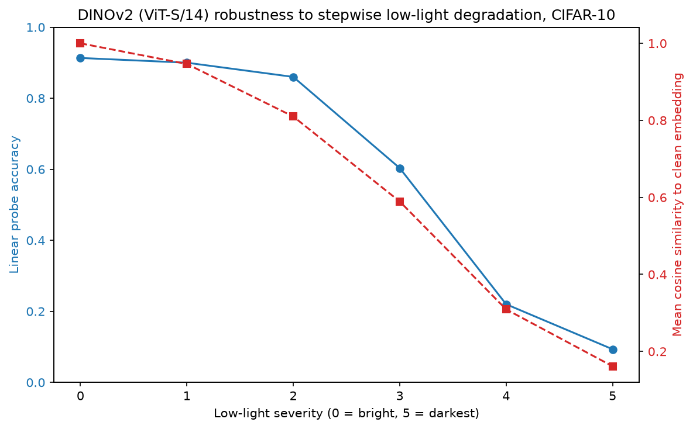
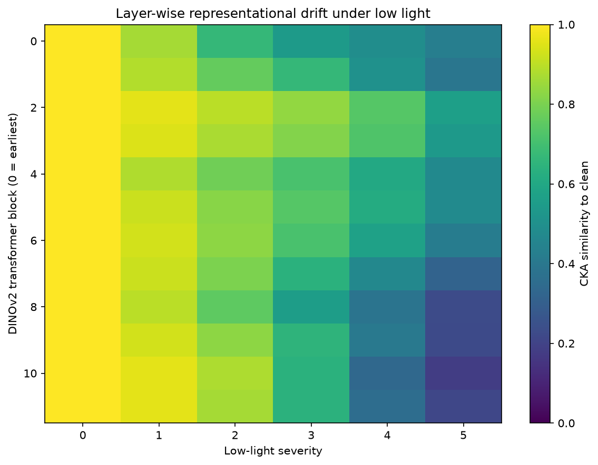
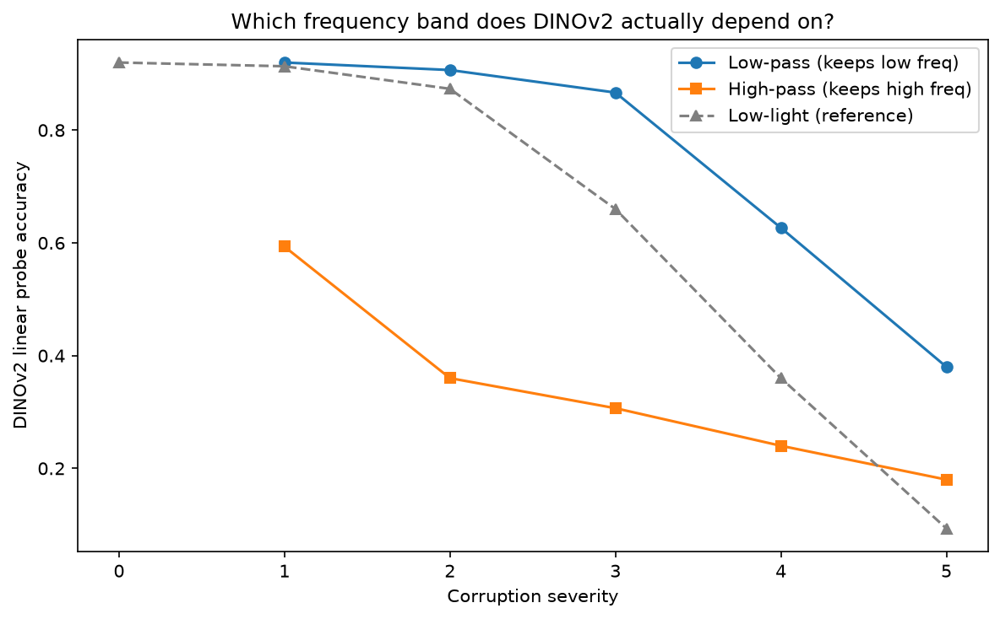
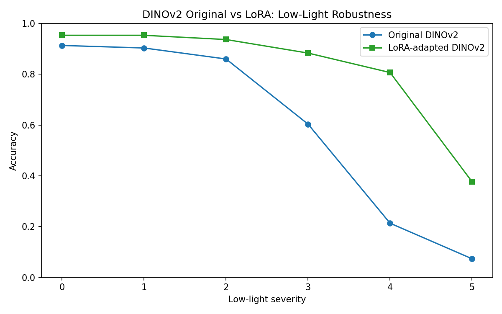
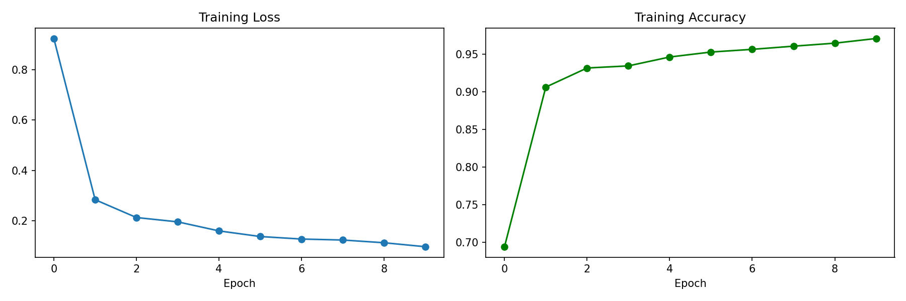

# DINOv2 Low-Light Robustness Study

**How badly does DINOv2 break in the dark, where does it break, why — and can we fix it by training 1% of the network?**

This project stress-tests Facebook's **DINOv2 ViT-S/14** (frozen, self-supervised backbone) against progressive low-light degradation on **CIFAR-10**, localizes the failure inside the network, identifies its mechanism, and remediates it with LoRA adapters.

---

## The Three-Phase Pipeline

```
Phase 1: MEASURE          Phase 2: LOCALIZE & EXPLAIN        Phase 3: REMEDIATE
run_notebook1.py          run_notebook2.py                   run_lora_simple_colab.py
1000 imgs, 6 severities   500 imgs + layer hooks + FFT       LoRA rank-8 on attention
linear probe accuracy     CKA drift, frequency ablation,     70% dark / 30% clean diet
+ embedding drift         bootstrap CIs                      10 epochs, T4 GPU
```

**Corruption model:** `low_light()` scales pixel intensity down and adds Gaussian noise — severity 0 = clean, severity 5 = near-black + heavy noise (ImageNet-C style).

---

## Results Summary: How the Three Phases Connect

Each phase answers one question and hands its finding to the next:

| Phase | Question | Answer | Hands to next phase |
|-------|----------|--------|---------------------|
| **1 — Measure** | *How bad is it?* | Accuracy collapses **0.91 → 0.09**; embeddings drift to near-orthogonality (cos 1.00 → 0.16) | The failure is real, severe, and representational — *but where?* |
| **2 — Localize & explain** | *Where and why?* | CKA pins the drift on **late attention blocks** (max drop 0.81 at block 10 vs 0.58 at patch embed); frequency ablation shows the model runs on **low-frequency luminance** — exactly what darkness removes | The failure has an address (late attention) and a mechanism (lost low-freq structure) — *so fix that, precisely* |
| **3 — Remediate** | *Can it be fixed cheaply?* | LoRA on those attention layers (0.99% of params, 70/30 dark/clean diet) restores **mean 0.59 → 0.82**, **worst-case 5.1×**, clean accuracy unchanged-or-better | Confirms the causal story: fix the localized shift, recover the robustness |

All phases on one axis — accuracy per severity (Phase 3 fixed-augmentation run; the original column matches Phase 1 within eval-noise jitter):

| Severity | Original DINOv2 | Embedding drift (cos sim) | + LoRA | Gap recovered |
|----------|-----------------|---------------------------|--------|---------------|
| 0 (clean) | 0.913 | 1.000 | 0.953 | clean gets *better* |
| 1 | 0.903 | 0.946 | 0.953 | +0.050 |
| 2 | 0.860 | 0.810 | 0.937 | +0.077 |
| 3 | 0.603 | 0.589 | 0.883 | +0.280 |
| 4 | 0.213 | 0.309 | 0.807 | +0.593 |
| 5 (darkest) | 0.073 | 0.161 | 0.377 | +0.303 |

The drift column is the Phase 1/2 fingerprint: accuracy loss tracks embedding drift almost linearly. The LoRA column shows the recovery tracks the *same axis back up*. One phenomenon, measured, explained, and reversed.

---

## Results

### Phase 1 — DINOv2 is not robust to darkness

Linear probe (logistic regression on frozen embeddings), 1000 test images:

| Severity | Accuracy | Cosine sim to clean embeddings |
|----------|----------|-------------------------------|
| 0 (clean) | 0.913 | 1.000 |
| 1 | 0.900 | 0.946 |
| 2 | 0.860 | 0.810 |
| 3 | 0.603 | 0.589 |
| 4 | 0.220 | 0.309 |
| 5 (darkest) | 0.093 | 0.161 |

Accuracy falls **0.82 points** and embeddings drift to near-orthogonality (cos ~0.16) — near-flat through severity 2, collapsing steeply between severity 2 and 4.



### Phase 2 — The failure is localized, systematic, and low-frequency

**Layer-wise CKA** (hooks on all 12 transformer blocks, drift measured clean → severity 5):

| Layer | CKA drop |
|-------|----------|
CKA drop (clean → severity 5) by layer — full matrix in `output/notebook2/cka_matrix.csv`:

| Layer | CKA drop |
|-------|----------|
| block 0 (patch embed) | 0.58 |
| block 5 | 0.53 |
| **block 10** | **0.81** ← max drift |
| block 11 (final) | 0.78 |

→ Degradation is **not uniform**: late attention layers shift their representations far more than early ones.

**Frequency ablation** (low-pass vs. high-pass filtered inputs): low-pass-filtered images retain near-clean accuracy (~0.92 at severity 1) while high-pass destroys it (~0.59) — at every severity the low-frequency band dominates.

→ DINOv2 leans on **low-frequency luminance structure**, which is precisely what darkness removes.





### Phase 3 — LoRA on late attention layers recovers most of the loss

LoRA adapters (rank 8, α 16) on QKV/output projections, **221K trainable params = 0.99%** of the network, trained 10 epochs on 5000 images (70% darkened / 30% clean). Free-tier Colab T4, ~10 minutes of training. This is the **run of record**: per-sample seeded augmentation RNG and matched-noise evaluation (see `docs/METHODS.md` §7.3, §9.6–9.7); artifacts in `colab_results/lora_run_fixed/`.

| Severity | Original | LoRA | Δ |
|----------|----------|------|-----|
| 0 (clean) | 0.913 | 0.953 | +0.040 |
| 1 | 0.903 | 0.953 | +0.050 |
| 2 | 0.860 | 0.937 | +0.077 |
| 3 | 0.603 | 0.883 | **+0.280** |
| 4 | 0.213 | 0.807 | **+0.593** |
| 5 (darkest) | 0.073 | 0.377 | **+0.303** |
| **Mean** | **0.594** | **0.818** | **+0.224** |

**Worst-case accuracy improved 5.1×** (0.073 → 0.377), the near-failure regime (severity 4) recovered to 0.81, and clean accuracy *rose* — no catastrophic forgetting from the mixed diet.





**Phase 3 v2 — the full comparison grid.** The Phase 0 refactor of `run_lora_simple_colab.py` turned each extension into a flag, enabling the three arms the original single-run design lacked: multi-seed error bars, CKA-guided rank allocation, and the full fine-tuning baseline. Artifacts: `colab_results/sessionD/`; full discussion in `docs/RESEARCH.md` §6.1–6.2.

| Arm | Trainable params | Mean acc ± SD (3 seeds) | Sev 5 mean | Clean mean |
|-----|-----------------|--------------------|-----------------|---------------|
| Original (frozen) | 0 | 0.598 | 0.083 | 0.913 |
| Uniform LoRA r8 | 221,184 (0.99%) | 0.827 ± 0.012 (0.815–0.839) | 0.390 | 0.972 |
| Late-only (blocks 9–11, r8) | 55,296 (0.25%) | 0.686 | 0.160 | 0.937 |
| **Drift-weighted ranks (∝ CKA drop)** | **172,800 (0.78%)** | **0.825 ± 0.016 (0.811–0.842)** | 0.371 | 0.973 |
| Full fine-tuning | 22,056,576 (100%) | 0.831 ± 0.019 (0.810–0.846) | 0.436 | 0.960 |

**Read:** CKA-guided ranks match uniform LoRA and full fine-tuning at **0.78%** of the trainable parameters — now with 3-seed error bars on every headline arm, all ranges fully overlapping; full FT buys no extra mean robustness and posts the *worst* clean accuracy (forgetting cost, replicating across seeds); late-only shows the drift profile needs a total-budget floor. Per-arm SDs (±1.2–1.9 points) set the resolution of any comparison — parity is claimed, superiority is not. Per-severity cells for all nine arms: `docs/RESEARCH.md` §6.1; 3-seed table: `output/seed_replication/seed_analysis.csv`.

**Sim-to-real (ExDark, 7,363 real low-light photographs).** Frozen DINOv2 probes at **0.725** with a *flat* darkness-response curve (darkest quintile 0.713 vs brightest 0.704); CLAHE buys **+0.001** — real darkness within ExDark's range does not reproduce the synthetic collapse. Synthetic-dark adapters (drift arm, trained only on CIFAR darkness) lift real-dark accuracy to **0.743 (+1.9 pts)**; the uniform arm transfers **0.741 (+1.6 pts)** — indistinguishable, matching the synthetic-grid parity. Genuine transfer, but only ~9% of the +21-point gain the same adapters buy on the synthetic severity axis. The study quantifies the sim-to-real gap rather than assuming it away.

---

## The Story in One Paragraph

DINOv2's low-light failure is **not** diffuse noise sensitivity. It is a systematic representational shift concentrated in the **late attention layers** (CKA drop 0.81 at block 10 vs 0.58 at the patch embedding), driven by the loss of **low-frequency luminance structure** — the exact signal the model depends on most. Because the failure is localized, a **targeted 0.99%-parameter intervention** (LoRA on attention, trained on a dark/clean mix) recovers +0.22 mean accuracy and 5.1× worst-case robustness at a training cost of ~10 GPU-minutes — and letting the CKA diagnostic allocate the adaptation budget (drift-weighted ranks) matches both uniform LoRA and full fine-tuning at 0.78% of the parameters. On real darkness the story sharpens: ExDark accuracy is flat across luminance and enhancement buys nothing, yet synthetic-dark adapters still transfer +1.9 points — synthetic extreme darkening and real low light are different regimes, and the gap is now measured, not assumed.

---

## Running It

### Local (CPU, ~10–25 min per analysis notebook)

```bash
python3 -m venv .venv && source .venv/bin/activate
pip install -r requirements.txt
python run_notebook1.py    # Phase 1 → output/notebook1/
python run_notebook2.py    # Phase 2 → output/notebook2/
```

### Colab GPU (LoRA, ~15 min on free-tier T4)

Paste or upload `run_lora_simple_colab.py` into a Colab notebook and run — it installs its own deps and writes to `/content/output/`. Via the Colab CLI:

```bash
colab new -s lora_run --gpu T4
colab upload -s lora_run run_lora_simple_colab.py /content/run_lora_simple_colab.py
colab exec -s lora_run -f launch_lora.py    # nohup-detached launcher
```

---

## Repository Layout

| Path | Role |
|------|------|
| `utils.py` | Shared library: corruption fns, DINOv2 loading, hook extraction, linear probe, CKA, bootstrap CI, plotting |
| `run_notebook1.py` / `run_notebook1_colab.py` | Phase 1 runner (local / Colab) |
| `run_notebook2.py` / `run_notebook2_colab.py` | Phase 2 runner: CKA, frequency ablation, bootstrap CIs (local / Colab) |
| `run_lora_simple_colab.py` | Phase 3: manual LoRA (no PEFT dependency) — parameterized (rank/layers/seed/corruption/model); produced the results above |
| `run_exdark_baseline.py` | ExDark real-dark suite: 12-class probe, darkness-response curve, CLAHE control, adapter transfer (streaming, feature cache) |
| `run_lora_finetune_colab.py` | Phase 3 alternative using the PEFT library |
| `dinov2_*.ipynb` | Original notebook forms of all three phases |
| `output/notebook1/`, `output/notebook2/` | Local results: CSVs, accuracy/drift plots, CKA heatmap, bootstrap CI, frequency test |
| `colab_results/` | Colab-run artifacts (LoRA plots + log, earlier Phase 1/2 runs, Phase 3 v2 grid in `sessionD/`) |
| `colab_gpu_bench.py`, `colab_probe.py` | Colab CLI probes: auth/runtime check + T4 throughput benchmark |
| `docs/RESEARCH.md` | **Full research narrative**: aim, hypotheses, methodology rationale, findings, bugs-as-lessons, limitations, future work |
| `docs/METHODS.md` | Formal methods appendix: corruption parameter tables, CKA math, seed registry, environment versions |

## Reproducibility Notes

- Backbone: `torch.hub` DINOv2 ViT-S/14, frozen; input 224×224, patch 14
- Phase 1/2 linear probes: 80/20 train/test split on clean embeddings, evaluated per severity
- CKA: linear CKA with `sqrt` normalization (`CKA = HSIC(X,Y) / sqrt(HSIC(X,X)·HSIC(Y,Y))`), unbiased by clean-vs-degraded sample pairing
- Bootstrap: 1000 resamples, per-severity independent RNG seeds
- LoRA: AdamW with deduplicated parameter groups (head params excluded from the adapter group), lr as in script, batch 64, 10 epochs
- ExDark suite: stratified 70/30 split (seed 42) identical across all passes; adapters rebuilt from the rank config embedded in `lora_adapters.pt`
